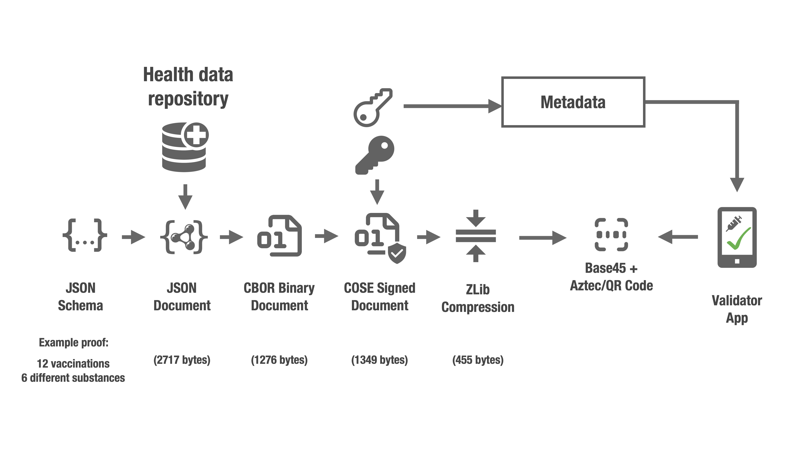

[![CC BY 4.0][cc-by-shield]][cc-by]

# Electronic Health Certificates

This repository contains a proposal for encoding and signing Electronic Health Certificates (EHC), as a candidate to be adapted and adopted by eHealth authorities and other stakeholders as they seem fit.

## Specification

[A draft specification is available](spec.md).

## Overview

## Requirements and Design Principles

The following requirements and principles has been used when designing the Electronic Health Certificates (EHC):

  1. Electronic Health Certificates shall be carried by the holder and must have the ability to be securely validated off-line (using strong and proven cryptographic primitives).

     *Example: Signed data with machine readable content.*

  2. Use an as compact encoding as practically possible, taking other requirements into consideration, to ensure reliable decoding using optical means.

     *Example: CBOR in combination with deflate compression and Aztec encoding.*

  3. Use existing, proven and modern open standards, with running code available (when possible) for all common platforms and operating environments to limit implementation efforts and minimise risk of interoperability issues.

     *Example: CBOR Web Tokens (CWT).*

  4. When existing standards does not exist, define and test new mechanisms based on existing mechanisms and ensure running code exists.

     *Example: Base45 encoding per new Internet Draft.*

  5. Ensure compatibility with existing systems for optical decoding.

     *Example: Base45 encoding for optical transport.*

## Known Implemenations

- [hcert test tool by Kirei AB](https://github.com/kirei/hcert)

## Presentation

[A short presentation on the background of this initative is available](https://github.com/kirei/hcert/blob/main/hcert-preso.pdf).

## Contributions

Contributions are very welcome - please file a pull request.

_________________

This work is licensed under a [Creative Commons Attribution 4.0 International License][cc-by].

[![CC BY 4.0][cc-by-image]][cc-by]

[cc-by]: http://creativecommons.org/licenses/by/4.0/
[cc-by-image]: https://i.creativecommons.org/l/by/4.0/88x31.png
[cc-by-shield]: https://img.shields.io/badge/License-CC%20BY%204.0-lightgrey.svg
